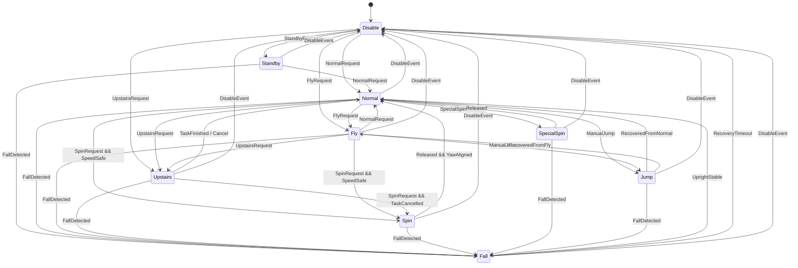
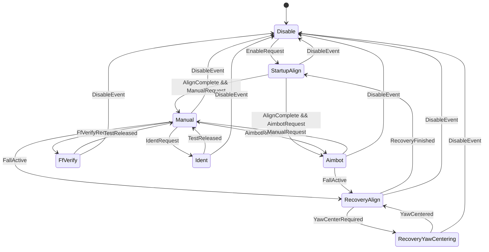

# Wheel Legged 底盘与云台状态机设计

## 1. 设计目标

状态机负责决定系统当前“做什么”，控制器负责决定“如何输出力矩”。状态机不得直接读取 DR16 原始值，也不得直接操作电机。

重构后的状态机计划使用 ETL FSM 实现：

- 固定容量，无动态内存分配。
- 每个状态使用独立 state class。
- 使用事件驱动状态迁移，而不是在一个 `Update()` 中维护大型 switch。
- 状态进入、退出动作通过 `on_enter_state()` 和 `on_exit_state()` 管理。
- 暂时保持现有 `Fsm::Input`、`Fsm::Output`、`Update()` 外部接口，降低迁移影响。

## 2. 状态机边界

整车控制至少拆分为两个顶层状态机：

- `ChassisFsm`：决定底盘行为和底盘控制权限。
- `GimbalFsm`：决定云台权限、目标来源及辨识模式。

发射机构不作为底盘或云台状态的隐含副作用，应由统一控制语义明确提供：

- `friction_enabled`
- `loader_enabled`
- `fire_request`

因此允许出现“底盘 Disable，但云台 Aimbot 有力”的组合。

## 3. 底盘状态机

### 3.1 状态定义

| 状态 | 含义 | 主要输出 |
| --- | --- | --- |
| `Disable` | 底盘全部执行器无力 | 关节和轮毂力矩为零 |
| `Standby` | 定点射击准备状态；Infantry 用于打符，Hero 用于吊射 | 保持安全姿态，轮端关闭或位置锁定，具体策略按车型配置 |
| `Normal` | 普通低腿长行驶 | 低腿长、常规 LQR、允许移动 |
| `Fly` | 中腿长行驶 | 中腿长、对应速度和斜坡参数 |
| `Upstairs` | 高腿长及上台阶任务 | 高腿长；根据子模式执行上台阶任务 |
| `Spin` | 普通小陀螺 | 低腿长、自旋、允许全向平移投影 |
| `SpecialSpin` | 变化腿长的变速小陀螺 | Reserved，当前不执行专用控制 |
| `Fall` | 倒地检测与自起恢复 | 关闭轮端，根据姿态执行腿部恢复 |
| `Jump` | 跳跃动作 | 分阶段收腿、蹬伸、回收 |

`Disable` 在本状态机中表示“底盘电机全部无力”。整车输入完全失效时，云台 FSM 也会进入 Disable，从而形成整车所有电机无力。

### 3.2 与旧状态的对应关系

| 新状态 | 当前代码状态 |
| --- | --- |
| `Disable` | `kDisabled` |
| `Standby` | `kStandby` |
| `Normal` | `kLowLeg` |
| `Fly` | `kMidLeg` |
| `Upstairs` | `kHighLeg` + `kStairTask` |
| `Spin` | `kSpin` + `kSpinExitPending` |
| `SpecialSpin` | 无，Reserved |
| `Fall` | `kRecoveryFallCheck` + `kRecoverySelfRight` |
| `Jump` | `kJumpPrep` + `kJumpPush` + `kJumpRecover` |

`kStairDescend` 不保留为正式底盘状态。下台阶作为 Reserved 请求记录，完成控制设计后再决定加入独立状态还是作为 `Normal` 的行为子模式。

### 3.3 Upstairs 子模式

`Upstairs` 包含三种任务模式，根据输入按键选择：

| 子模式 | 当前触发 | 含义 |
| --- | --- | --- |
| `Single` | 键鼠 `V` | 完成一次上台阶动作 |
| `Double` | 键鼠 `B` | 连续完成两次上台阶动作 |
| `Continuous` | DR16 高姿态保持 | 接触释放后可重复上台阶 |

动作序列沿用当前设计：

```text
Armed -> Hook -> Retract -> Settle -> Succeeded
                     \-> Aborted
```

第二次上台阶允许使用独立参数，并保留当前 Hook 完成后触发起立流程的设计。

### 3.4 Jump 子模式

`Jump` 包含两种触发来源：

| 子模式 | 状态 | 说明 |
| --- | --- | --- |
| `Manual` | 实现 | DR16 拨轮或键鼠滚轮触发 |
| `Automatic` | Reserved | 自动检测障碍并触发，当前不执行 |

手动跳跃内部阶段沿用当前逻辑：

```text
Prepare -> Push -> Recover -> Normal/Fly
```

- `Prepare`：收腿至预备长度。
- `Push`：蹬伸，达到腿长并稳定一定时间后进入回收；超时兜底。
- `Recover`：收腿并等待落地，最低持续时间和总超时共同保护。
- 触发时记录原姿态，允许 Normal 或 Fly 跳跃后返回对应状态。

自动跳跃只预留事件和枚举，不接入传感器检测或力矩输出。

### 3.5 Fall 内部阶段

`Fall` 合并当前两个恢复状态，但内部仍需保留阶段：

```text
Confirm -> SelfRight -> Standup -> Normal
```

- `Confirm`：姿态异常持续达到确认时间才开始自起，短时扰动可退出。
- `SelfRight`：根据 pitch、roll 和双腿摆角选择恢复策略。
- `Standup`：腿部进入安全范围后执行收腿和摆角归零。
- 恢复超时进入 `Disable`。
- pitch/roll 正常但腿摆角异常时，先请求云台 yaw 归中，再允许摆腿恢复。

当前代码中的手动恢复输入和手动恢复 PID 没有接入实际控制。重构时若不再需要，应删除；如保留，应定义为 `Fall::Manual` 子模式而不是散落字段。

### 3.6 Spin 与 SpecialSpin

`Spin` 沿用当前行为：

- 进入前要求车速低于安全阈值。
- 自旋目标速度根据裁判系统功率上限和超级电容状态分档。
- 自旋时允许把云台坐标系平移指令投影到底盘纵向轴。
- 退出后先等待 yaw 对齐，或由超时兜底，再回到稳定状态。
- 退出后暂时锁定低腿长，直到驾驶员重新选择姿态。

`SpecialSpin` 为 Reserved：

- 目标是变化腿长的变速小陀螺。
- 当前仅允许状态进入、UI 和调试可观测。
- 在腿长轨迹、自旋速度调度和安全边界完成前，控制输出应降级为普通 `Spin` 或拒绝进入；实现时必须明确选择其中一种策略。

### 3.7 底盘全局事件优先级

底盘事件按以下优先级处理：

```text
EmergencyDisable
  > InputLost / RefereePowerOff
  > FallDetected
  > UpstairsAbortRecovery
  > Jump
  > SpecialSpin
  > Spin
  > Standby
  > Normal / Fly / Upstairs 请求
```

所有状态都必须响应前三类安全事件，不能因为处于 Jump、Spin 或 Upstairs 内部阶段而忽略失能和倒地请求。

### 3.8 底盘主要迁移关系



## 4. 云台状态机

### 4.1 状态定义

新需求没有重新命名云台全部状态，因此未说明部分沿用当前代码设计。

| 状态 | 含义 | 云台输出 | 目标来源 |
| --- | --- | --- | --- |
| `Disable` | 云台无力 | 关闭 | 无 |
| `StartupAlign` | 上电或重新使能后的 yaw 归中 | 开启 | 最近车头方向 |
| `Manual` | 调试/人工控制 | 开启 | 人工积分目标 |
| `Aimbot` | 自瞄 | 开启 | Host 优先，失效时人工目标 |
| `RecoveryAlign` | 底盘恢复期间对齐车体 | 开启 | 车体前方 |
| `RecoveryYawCentering` | 腿摆角恢复前的 yaw 归中 | 开启 | 最近车头方向，pitch 到安全上限 |
| `FfVerify` | 云台动力学前馈验证 | 开启 | 内部五次谐波轨迹 |
| `Ident` | 云台参数辨识 | 开启 | 内部五次谐波轨迹 |

当前 `ServiceWithFire`、`ServiceSafe` 和 `Combat` 应在重构后收敛为云台控制模式加独立的发射权限，避免状态名称与实际发射使能不一致。

### 4.2 DR16 组合对应关系

| DR16 组合 | 云台状态 | 发射权限 |
| --- | --- | --- |
| 左下 + 右下 | `Aimbot` | 禁止 |
| 左下 + 右中 | `Aimbot` | 允许 |
| 左下 + 右上 | `Aimbot` | 允许 |
| 左中 + 任意 | `Manual` | 禁止 |
| 左上 + 右下 | `Manual` | 禁止 |
| 左上 + 右中 | `FfVerify` | 禁止 |
| 左上 + 右上 | `Ident` | 禁止 |

### 4.3 云台迁移规则

- 输入无效或整车紧急失能：任意状态立即进入 `Disable`。
- 从 `Disable` 重新使能：先进入 `StartupAlign`。
- `StartupAlign` 连续满足 yaw 误差和速度阈值后，进入请求的 `Manual` 或 `Aimbot`。
- `FfVerify` 和 `Ident` 由明确的 DR16 组合直接请求，但仍受输入失效和安全失能约束。
- 底盘进入 Fall 时，优先进入 `RecoveryAlign`；若腿部恢复要求 yaw 先归中，则进入 `RecoveryYawCentering`。
- 恢复退出时，把人工云台目标同步到当前实测角度，防止目标跳变。
- Aimbot 状态下 Host 目标无效时降级为人工目标，不直接关闭云台。



## 5. ETL FSM 事件建议

建议只定义少量高层事件，事件携带本周期统一请求和反馈快照：

| 事件 | 用途 |
| --- | --- |
| `TickEvent` | 常规周期更新、计时和条件判断 |
| `DisableEvent` | 输入离线、裁判断电、紧急停机 |
| `ModeRequestEvent` | Normal、Fly、Upstairs、Standby、Spin 等模式请求 |
| `FallDetectedEvent` | 倒地或任务恢复请求 |
| `ActionEvent` | Jump、任务取消、SpecialSpin 等边沿动作 |

`TickEvent` 可以携带只读上下文，但状态机内部只保存状态相关的最小跨周期数据，例如进入时间、跳跃来源姿态和 Spin 退出锁存。

## 6. 状态输出约定

底盘状态机统一输出：

- 当前状态和子模式。
- 状态是否发生变化。
- 底盘执行器权限。
- 轮端权限。
- 行为标识和运动目标。
- 进入状态时间、超时和终止原因。

云台状态机统一输出：

- 当前状态。
- 云台执行器权限。
- 当前目标来源。
- 是否执行车体对齐。
- 测试模式。
- 发射权限不得再隐含在状态名称中，应由上层模式语义单独输出。

状态机不得输出未被消费的冗余字段。当前代码中的 `recovery_enable`、`safe_output_required` 和 `jump_phase` 要么真正接入行为层，要么在迁移时删除。

## 7. 暂留功能处理原则

以下功能只保留协议、枚举、输入映射和调试可观测性：

- 下台阶模式。
- `SpecialSpin`。
- 自动触发 Jump。

Reserved 功能不允许包含隐藏的半成品力矩分支。正式实现时应分别补充：进入条件、退出条件、超时、安全边界、目标生成器、执行器权限和测试用例。
