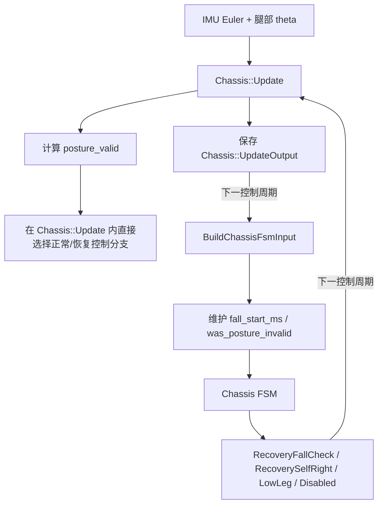
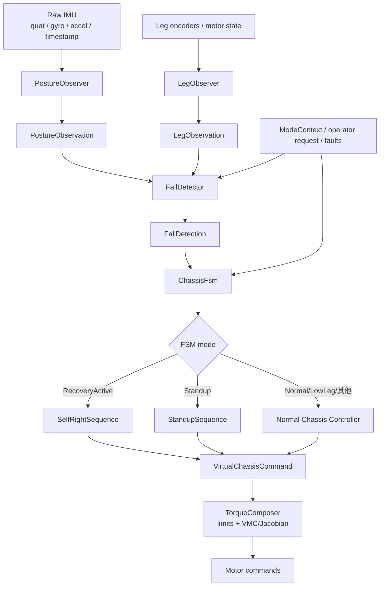
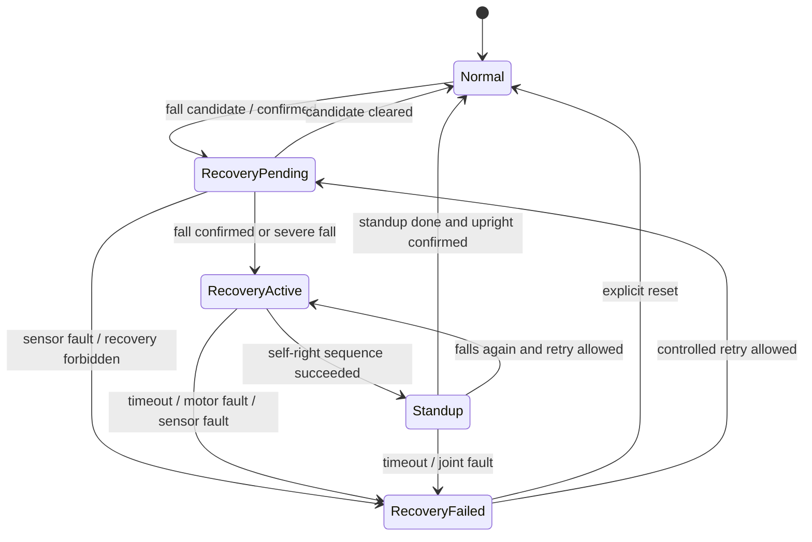

# 轮腿底盘倒地检测与自起模块重构设计方案

> 项目：`embedded-2026-h7 / wheel_legged`  
> 文档状态：设计评审稿  
> 版本：V1.0  
> 日期：2026-07-23  
> 适用基线：当前默认参数分支 `Infantry3`，同时给出多机型参数迁移方式

## 0. 核心结论

建议采用以下总体方案：

1. 使用 IMU 融合输出的四元数作为机身姿态的主要信息源。
2. 从四元数直接计算“世界竖直方向在机体系下的表示”：

   ```cpp
   gravity_body.x
   gravity_body.y
   gravity_body.z
   ```

   更准确地说，本文推荐计算世界“向上”方向 `up_body`。如果项目中变量命名为
   `gravity_body`，必须明确它表示的是“向上”还是“重力向下”，两者符号相反。

3. 使用 `up_body.z` 判断机身倾斜程度，避免直接使用 Euler pitch/roll：

   - `up_body.z ≈ +1`：机体上轴与世界上轴同向，机身直立。
   - `up_body.z ≈ 0`：机身大约倾斜 90°，处于侧躺、前趴或后躺。
   - `up_body.z ≈ -1`：机体倒扣。

4. 使用 `up_body.x`、`up_body.y` 判断倒地方向，但必须先通过六面静置测试确认坐标系和符号。
5. 加速度计不能作为所有动态场景下的唯一倒地判据，只适合：

   - 低动态时校验四元数方向；
   - 检测冲击、自由落体或异常运动；
   - IMU 数据质量诊断。

6. 将当前单个 `posture_valid` 拆成至少以下独立语义：

   ```cpp
   sensor_valid
   body_upright
   body_upright_confirmed
   fall_confirmed
   severe_fall
   leg_configuration_safe
   recovery_allowed
   recovery_active
   ```

7. 将当前倒地检测、自起动作和起立动作拆成独立模块：

   - `PostureObserver`
   - `FallDetector`
   - `ChassisFsm`
   - `SelfRightSequence`
   - `StandupSequence`
   - `TorqueComposer`

8. 自起失败后必须进入持久的 `RecoveryFailed/Lockout` 状态，不能只停机一个控制周期后又自动恢复。

---

## 1. 重构目标

### 1.1 目标

- 避免 Euler 角奇异性、角度绕回和 pitch/roll 耦合对倒地判断的影响。
- 建立与 yaw 无关、几何意义明确的机身倾斜量。
- 支持前、后、左、右、倒扣和斜向倒地分类。
- 把机身姿态、腿部构型、传感器质量和恢复许可拆开表达。
- 消除 FSM 使用上一周期 `Chassis::UpdateOutput` 判断当前倒地状态的循环依赖。
- 使倒地检测、状态转移、自起动作和起立动作都能独立单元测试。
- 为每个动作阶段增加完成条件、连续稳定时间、超时和故障出口。
- 支持影子运行、日志回放、分级实机测试和快速回滚。
- 保留不同机器人 variant 的参数差异。

### 1.2 本阶段不做的事情

- 不重新设计 VMC、腿部动力学、Jacobian 和电机底层闭环。
- 不在没有日志和实机数据的情况下直接冻结最终阈值。
- 不在第一版同时大幅重调所有自起力矩。
- 不把加速度计单独当作动态场景中的最终姿态解算器。

---

## 2. 当前代码逻辑审计

### 2.1 当前主要数据流



当前结构的问题不是单一判断公式不理想，而是存在以下循环：

```text
本周期控制结果
    ↓
成为下一周期的姿态/FSM 输入
    ↓
决定下一周期模式
    ↓
再影响下一周期控制结果
```

这会导致：

- 倒地事件有隐式一拍延迟；
- 检测时间和动作时间难以严格定义；
- `RecoveryFallCheck` 是否真的“只等待确认”不直观；
- 重构时容易改变时序但无法定位原因。

### 2.2 当前 `posture_valid`

当前姿态有效判断主要位于：

- [`chassis.cc`](../../app/targets/wheel_legged/chassis.cc)

当前逻辑把以下信息合并为一个布尔量：

- 机身 pitch 是否在范围内；
- 机身 roll 是否在范围内；
- 左右腿 `theta` 是否在范围内。

概念上类似：

```cpp
const bool pitch_roll_valid =
    pitch_in_range &&
    roll_in_range;

const bool theta_valid =
    left_theta_in_range &&
    right_theta_in_range;

output_.posture_valid = pitch_roll_valid && theta_valid;
```

这里存在一个重要语义问题：

```text
posture_valid == false
```

可能表示：

- 机身确实倒地；
- 腿摆角越界；
- 机身和腿同时越界；
- 传感器数据异常；
- 当前动作本来就允许腿进入该范围。

但后续逻辑只看到一个 `false`，无法知道原因。

### 2.3 当前倒地计时

倒地计时与 FSM 输入主要位于：

- [`input.cc`](../../app/targets/wheel_legged/input.cc)
- [`input.hpp`](../../app/targets/wheel_legged/include/input.hpp)
- [`control.cc`](../../app/targets/wheel_legged/control.cc)

当前 `BuildChassisFsmInput()` 使用上一周期的：

```cpp
chassis_control_output.posture_valid
```

并通过外部静态变量维护：

```cpp
fall_start_ms
was_posture_invalid
```

这意味着倒地检测状态不属于明确的 `FallDetector`，而是分散在控制循环和输入构造函数中。

### 2.4 当前恢复 FSM

恢复状态主要位于：

- [`chassis_fsm.cc`](../../app/targets/wheel_legged/chassis_fsm.cc)
- [`fsm.hpp`](../../app/targets/wheel_legged/include/chassis/fsm.hpp)
- [`fsm_common.hpp`](../../app/targets/wheel_legged/include/fsm_common.hpp)

当前关键状态：

```cpp
kRecoveryFallCheck
kRecoverySelfRight
```

当前参数中可以看到：

```cpp
kRecoveryFallConfirmMs
kRecoverySelfRightTimeoutMs
```

但目前 `RecoveryFallCheck` 与 `RecoverySelfRight` 的控制输出非常接近，且
`Chassis::Update()` 内又会根据 `posture_valid` 直接进入恢复动作分支。

因此，名义上的倒地确认等待时间并不一定真正延迟了物理自起动作。

正确语义应该是：

```text
RecoveryPending/FallCheck
    = 只观察、计时和准备
    ≠ 已经开始翻身动作
```

### 2.5 当前自起失败问题

当前 `RecoverySelfRight` 超时后会转入 `Disabled`。

如果上层 domain 或使能条件仍然有效，`Disabled` 可能在下一周期又自动离开。因此：

- 自起超时未必形成持久故障；
- 机器人可能再次进入恢复；
- 失败原因和复位条件不明确；
- 存在反复启停风险。

建议新增：

```cpp
kRecoveryFailed
```

或：

```cpp
kRecoveryLockout
```

该状态必须持久保持，直到：

- 人工明确复位；
- 重新使能；
- 满足经过评审的有限重试条件。

### 2.6 当前起立逻辑

当前起立 Phase 0–3 主要位于：

- [`chassis.cc`](../../app/targets/wheel_legged/chassis.cc)
- [`chassis.hpp`](../../app/targets/wheel_legged/include/chassis/chassis.hpp)
- [`params.hpp`](../../app/targets/wheel_legged/include/params.hpp)

当前阶段意图可以概括为：

| 阶段 | 当前意图 | 当前主要完成条件 | 主要问题 |
|---|---|---|---|
| Phase 0 | 腿摆到初始目标 | 腿摆角接近目标 | 不同来源入口通过隐式 latch 区分 |
| Phase 1 | 收腿到低位 | 腿长接近目标 | 缺少正式连续稳定时间与阶段超时 |
| Phase 2 | 保持低腿长，摆角斜坡回零 | 摆角误差满足容差 | ramp 使用每周期步长，依赖控制频率 |
| Phase 3 | 完成并交回正常控制 | phase 置完成 | 完成事件、姿态稳定和 FSM 转移耦合 |

当前还存在类似：

```cpp
standup_from_recovery_latch_
standup_phase_stable_ticks_
```

等内部状态。部分字段可能没有真正形成稳定周期判断，或只通过隐式来源判断选择入口。

### 2.7 当前 IMU 坐标映射

当前执行器反馈中已经存在 Euler 和陀螺仪的轴交换/符号调整，相关代码位于：

- [`actuators.hpp`](../../app/targets/wheel_legged/include/actuators.hpp)

这说明：

```text
IMU 传感器坐标系 != 底盘机体系
```

因此接入四元数时不能只把 `quat_w/x/y/z` 原样送入公式。必须先确认：

- 四元数顺序；
- 四元数表示的旋转方向；
- 左手系/右手系；
- IMU 固定安装旋转；
- 车体机体系轴定义。

IMU 库已经提供四元数：

- [`hipnuc_imu.hpp`](../../libs/librm/src/librm/device/sensor/hipnuc_imu.hpp)
- [`hipnuc_imu_can.hpp`](../../libs/librm/src/librm/device/sensor/hipnuc_imu_can.hpp)

访问形式为：

```cpp
quat_w()
quat_x()
quat_y()
quat_z()
```

---

## 3. 为什么使用机体系竖直向量

### 3.1 Euler 角的问题

Euler pitch/roll 用于显示和人工理解很方便，但作为倒地判断量存在以下问题：

- 接近特定姿态时存在奇异性；
- 不同 Euler 顺序结果不同；
- 角度可能在 `+π/-π` 附近绕回；
- 大倾角时 pitch 与 roll 的含义互相耦合；
- 同一个实际倾斜状态可能出现不直观的 pitch/roll 组合；
- 需要分别设置 pitch 与 roll 阈值，难以表达斜向倒地。

### 3.2 竖直向量的几何意义

定义世界上方向：

```text
e_z = [0, 0, 1]^T
```

将其变换到机体系，得到：

```text
up_body = [u_x, u_y, u_z]^T
```

其中：

```text
u_z = 机体上轴与世界上轴夹角的余弦
```

因此：

```text
tilt = acos(clamp(u_z, -1, 1))
```

但实时检测通常不需要计算 `acos`，可以直接比较余弦：

```text
tilt > 50°
等价于
u_z < cos(50°) ≈ 0.643
```

### 3.3 与 yaw 解耦

机器人保持直立并绕世界竖直轴旋转时：

```text
up_body ≈ [0, 0, 1]
```

因此单纯 yaw 变化不会改变 `u_z`，这非常适合倒地检测。

---

## 4. 四元数和旋转矩阵公式

## 4.1 坐标系定义

建议统一定义：

- 世界系 `W`：
  - `z_W` 向上；
  - 世界上方向 `e_z = [0,0,1]^T`。
- 机体系 `B`：
  - 推荐 `x_B` 向前；
  - 推荐 `y_B` 向左；
  - 推荐 `z_B` 向上。
- IMU 传感器系 `S`：
  - 由器件和安装方向决定；
  - 与机体系之间存在固定旋转 `R_BS`。

> 最终项目可以采用不同轴定义，但必须形成唯一书面约定，所有模块统一使用。

### 4.2 从旋转矩阵计算

#### 情况 A：四元数表示 `R_WB`

如果：

```text
v_W = R_WB · v_B
```

即旋转矩阵把机体系向量旋转到世界系，则：

```text
up_body = R_WB^T · e_z
```

因此 `up_body` 等于 `R_WB` 的第三行。

#### 情况 B：四元数表示 `R_BW`

如果：

```text
v_B = R_BW · v_W
```

即旋转矩阵把世界系向量旋转到机体系，则：

```text
up_body = R_BW · e_z
```

因此 `up_body` 等于 `R_BW` 的第三列。

### 4.3 从 `[w,x,y,z]` 四元数直接计算

对归一化四元数：

```text
q = [w, x, y, z]
```

如果 `q` 表示 `R_WB`，并采用常见右手 Hamilton 约定，则世界上方向在机体系中的表示为：

```cpp
up_body.x = 2.0f * (x * z - w * y);
up_body.y = 2.0f * (y * z + w * x);
up_body.z = 1.0f - 2.0f * (x * x + y * y);
```

这与计算：

```text
R_WB^T · [0,0,1]^T
```

等价。

### 4.4 如果项目变量叫 `gravity_body`

需要明确两种定义。

#### 定义 1：世界上方向

```cpp
gravity_body = up_body;
```

则：

```text
直立：gravity_body.z ≈ +1
倒扣：gravity_body.z ≈ -1
```

#### 定义 2：重力向下方向

```cpp
gravity_body = -up_body;
```

则：

```text
直立：gravity_body.z ≈ -1
倒扣：gravity_body.z ≈ +1
```

建议代码中直接使用更明确的命名：

```cpp
world_up_body
```

或：

```cpp
up_body
```

避免 `gravity` 到底表示向上还是向下的歧义。

### 4.5 四元数归一化

不能假设所有输入四元数始终严格单位化。

```cpp
const float norm2 =
    w * w + x * x + y * y + z * z;

const bool valid =
    std::isfinite(w) &&
    std::isfinite(x) &&
    std::isfinite(y) &&
    std::isfinite(z) &&
    norm2 > kMinQuaternionNorm2;

if (valid) {
  const float inv_norm = 1.0f / std::sqrt(norm2);
  w *= inv_norm;
  x *= inv_norm;
  y *= inv_norm;
  z *= inv_norm;
}
```

还应检查：

- IMU 样本是否超时；
- 四元数是否出现异常跳变；
- 时间戳是否连续；
- 数据是否被冻结；
- 四元数范数是否长期偏离 1。

### 4.6 `q` 和 `-q`

四元数：

```text
q
```

与：

```text
-q
```

表示同一个三维旋转。

本文公式全部由四元数二次项组成，因此 `q` 与 `-q` 会得到相同的 `up_body`。

这是一个必须加入单元测试的性质。

### 4.7 固定安装变换

如果先根据 IMU 四元数得到传感器系中的：

```text
up_sensor
```

则需要：

```text
up_body = R_BS · up_sensor
```

其中 `R_BS` 是 IMU 传感器系到机体系的固定旋转。

陀螺仪和加速度计也必须使用同一个安装变换：

```text
gyro_body  = R_BS · gyro_sensor
accel_body = R_BS · accel_sensor
```

禁止继续在不同文件中分别散落：

```cpp
x = y;
y = -x;
pitch = -pitch;
```

等补丁式轴映射。

---

## 5. 六面静置试验

在任何自起电机动作接入之前，必须完成六面静置试验。

假设机体系为：

```text
x_B 向前
y_B 向左
z_B 向上
```

则期望：

| 静置姿态 | 期望 `up_body` | 检查重点 |
|---|---:|---|
| 正常直立 | `[0,0,+1]` | `u_z` 接近 +1 |
| 车头朝上，机器人后躺 | `[+1,0,0]` | 确认 `u_x` 正方向 |
| 车头朝下，机器人前趴 | `[-1,0,0]` | 应与后躺相反 |
| 左侧朝上，机器人右侧躺 | `[0,+1,0]` | 确认 `u_y` 正方向 |
| 右侧朝上，机器人左侧躺 | `[0,-1,0]` | 应与右侧躺相反 |
| 倒扣 | `[0,0,-1]` | `u_z` 接近 -1 |

验证要求：

- 每个姿态下 `|q|` 接近 1；
- 每个姿态下 `|up_body|` 接近 1；
- 绕机体 `z` 轴改变 yaw 时，`up_body.z` 基本不变；
- `q` 和 `-q` 产生相同 `up_body`；
- 前、后、左、右符号均符合物理方向；
- 不允许只测直立和倒扣，因为这两种姿态不足以暴露全部符号问题。

建议形成独立配置：

```cpp
struct ImuFrameConfig {
  Quaternionf q_body_from_sensor;
  QuaternionDirection direction;
  AxisConvention axis_convention;
};
```

---

## 6. 加速度计能否单独判断倒地

### 6.1 静止时可以

机器人静止或低动态时，加速度计主要测到重力相关比力。

归一化加速度方向可以用于估计竖直方向：

```cpp
const Vec3 accel_dir =
    accel_body / Norm(accel_body);
```

在这种场景下，只用加速度计判断机身倾斜通常可行。

### 6.2 动态时不可靠

轮腿机器人会出现：

- 急加速；
- 急刹车；
- 原地旋转；
- 越障；
- 跳跃起落；
- 台阶攀爬；
- 碰撞和冲击；
- 自起动作本身产生的大线加速度。

加速度计测到的是比力，包含：

```text
重力相关项 + 机体线加速度 + 振动 + 冲击 + 噪声
```

因此：

```text
normalize(accel)
```

不一定等于真实重力方向。

极端情况下：

- 急加速可能被误判为倾斜；
- 自由落体时加速度模长接近 0，方向几乎失去意义；
- 碰撞时方向由冲击主导；
- 自起过程中会反过来干扰倒地方向判断。

### 6.3 推荐角色

推荐：

```text
四元数：主姿态判据
陀螺仪：动态和静稳确认
加速度计：低动态一致性校验 + 冲击/自由落体提示
```

低动态窗口可以定义为：

```cpp
const bool accel_low_dynamic =
    std::abs(Norm(accel_body) - kGravity) <
    params.accel_norm_tolerance_m_s2;
```

只有在该窗口内，才检查加速度方向与四元数方向是否一致：

```cpp
if (accel_low_dynamic) {
  const Vec3 accel_dir = Normalize(accel_body);
  const float consistency =
      Dot(accel_dir, expected_gravity_direction);

  if (consistency < params.accel_consistency_min) {
    attitude_inconsistency_timer.Update(true, dt);
  }
}
```

在高动态状态下：

```text
不要用加速度方向否决四元数的倒地判断
```

---

## 7. 推荐目标架构



推荐控制周期顺序：

```cpp
void ControlLoop(uint32_t now_ms, float dt_s) {
  const auto raw_sensors = ReadSensors(now_ms);

  const auto posture =
      posture_observer.Update(raw_sensors.imu, now_ms);

  const auto leg_state =
      leg_observer.Update(raw_sensors.legs, now_ms);

  const auto fall =
      fall_detector.Update(
          posture,
          leg_state,
          mode_context,
          now_ms);

  const auto fsm_output =
      chassis_fsm.Update(
          operator_request,
          fall,
          faults,
          now_ms);

  const auto sequence_output =
      UpdateSelectedSequence(
          fsm_output,
          posture,
          leg_state,
          dt_s);

  auto command =
      chassis_controller.Compose(
          fsm_output,
          sequence_output,
          posture,
          leg_state,
          dt_s);

  ApplySafetyLimits(command);
  WriteMotors(command);
  PublishTelemetry(...);
}
```

关键原则：

```text
同一周期的 Observation
    ↓
同一周期的 Detection
    ↓
同一周期的 FSM
    ↓
同一周期的动作输出
```

不再让 FSM 反向读取上一周期的：

```cpp
chassis_control_output.posture_valid
```

---

## 8. `PostureObserver` 设计

### 8.1 职责

`PostureObserver` 只负责：

- 输入数据质量检查；
- 四元数归一化；
- 四元数方向统一；
- IMU 安装变换；
- 计算 `up_body`；
- 将 gyro/accel 统一到机体系；
- 输出低动态标志；
- 输出传感器故障码。

它不负责：

- 倒地阈值；
- 倒地持续时间；
- FSM 状态转移；
- 自起动作；
- 电机命令。

### 8.2 推荐接口

```cpp
struct Quaternionf {
  float w;
  float x;
  float y;
  float z;
};

struct PostureObserverInput {
  Quaternionf quat_sensor;
  Vec3 gyro_sensor_rad_s;
  Vec3 accel_sensor_m_s2;
  uint32_t imu_sample_tick_ms;
};

enum class PostureFault {
  kNone,
  kQuaternionNonFinite,
  kQuaternionNormInvalid,
  kImuStale,
  kQuaternionDiscontinuity,
  kFrameConfigInvalid,
};

struct PostureObservation {
  Vec3 up_body;
  float tilt_cos;

  Vec3 gyro_body_rad_s;
  Vec3 accel_body_m_s2;
  float accel_norm_m_s2;

  bool quaternion_valid;
  bool imu_fresh;
  bool accel_low_dynamic;

  uint32_t sample_age_ms;
  PostureFault fault;
};
```

### 8.3 处理顺序

1. 检查四元数、陀螺仪和加速度计是否为有限值。
2. 检查 IMU 时间戳和数据新鲜度。
3. 检查四元数范数。
4. 在允许范围内归一化四元数。
5. 根据已确认的方向约定计算 `up_sensor`。
6. 使用固定安装旋转变换为 `up_body`。
7. 使用同一个安装旋转变换 gyro 和 accel。
8. 输出 `tilt_cos = up_body.z`。
9. 输出质量标志和故障码。

### 8.4 异常策略

| 异常 | Observer 输出 | 下游策略 |
|---|---|---|
| 四元数 NaN/Inf | `quaternion_valid=false` | 禁止方向性自起 |
| 四元数范数过小 | `fault=kQuaternionNormInvalid` | 传感器故障或安全停机 |
| IMU 数据超时 | `imu_fresh=false` | 不得无限沿用最后一次方向 |
| 加速度模长异常 | `accel_low_dynamic=false` | 忽略加速度方向校验 |
| 瞬时四元数跳变 | `fault=kQuaternionDiscontinuity` | 短时拒绝并计数 |
| 安装配置缺失 | `fault=kFrameConfigInvalid` | 编译或启动失败 |

---

## 9. `FallDetector` 设计

### 9.1 职责

`FallDetector` 负责：

- 倒地候选判断；
- 严重倒地快速路径；
- 倒地持续时间；
- 直立退出滞回；
- 直立连续稳定时间；
- 倒地方向分类和锁定；
- 机身姿态与腿构型原因分离；
- 输出稳定事件。

它不负责：

- 输出腿力矩；
- 控制 gimbal；
- 控制起立 phase；
- 决定电机符号。

### 9.2 推荐输出

```cpp
enum class FallDirection {
  kUnknown,
  kFront,
  kBack,
  kLeft,
  kRight,
  kInverted,
  kDiagonal,
};

enum class FallCause {
  kNone,
  kBodyTilt,
  kLegGeometry,
  kSensorFault,
  kExternalMode,
};

struct FallDetection {
  bool body_raw_upright;
  bool body_upright_confirmed;

  bool fall_candidate;
  bool fall_confirmed;
  bool severe_fall;

  bool leg_configuration_safe;
  bool sensor_valid;

  FallDirection direction;
  FallCause cause;

  uint32_t condition_hold_ms;
};
```

### 9.3 进入和退出阈值

推荐使用滞回：

```text
倒地进入角度 > 直立退出角度
```

建议初始范围：

| 事件 | 建议初值 | 说明 |
|---|---:|---|
| 普通倒地进入 | 45°–50°，持续 180–250 ms | 抑制瞬时冲击误触发 |
| 严重倒地进入 | 75°–80°，持续 50–100 ms | 明显倒地时快速响应 |
| 恢复直立退出 | 25°–30° 内，持续 300–500 ms | 形成滞回并等待稳定 |
| 直立角速度 | `|ω| < 0.5–1.0 rad/s` | 避免高速穿过直立 |

运行时预计算：

```cpp
enter_cos =
    std::cos(DegToRad(params.fall_enter_angle_deg));

severe_cos =
    std::cos(DegToRad(params.severe_angle_deg));

exit_cos =
    std::cos(DegToRad(params.upright_exit_angle_deg));
```

判定伪代码：

```cpp
fall_candidate =
    sensor_valid &&
    posture.up_body.z < enter_cos;

severe_candidate =
    sensor_valid &&
    posture.up_body.z < severe_cos;

upright_candidate =
    sensor_valid &&
    posture.up_body.z > exit_cos &&
    Norm(posture.gyro_body_rad_s) <
        params.upright_gyro_max_rad_s &&
    leg_configuration_safe;

fall_confirmed =
    HeldFor(fall_candidate,
            params.fall_confirm_ms) ||
    HeldFor(severe_candidate,
            params.severe_confirm_ms);

body_upright_confirmed =
    HeldFor(upright_candidate,
            params.upright_confirm_ms);
```

### 9.4 为什么直立退出要检查角速度

仅检查：

```cpp
up_body.z > exit_cos
```

可能在机器人快速摆过直立位置时提前结束恢复。

必须增加：

```cpp
Norm(gyro_body) < upright_gyro_max
```

并持续满足一定时间，才能表达：

```text
已经稳定直立
```

而不是：

```text
正在高速穿过直立姿态
```

### 9.5 腿构型必须独立

建议：

```cpp
body_upright_confirmed
```

只表示机身姿态和角速度稳定。

另有：

```cpp
leg_configuration_safe
```

表示：

- 腿角在安全范围；
- 腿长适合承载；
- 关节没有越界；
- 关节反馈有效；
- 必要时左右腿误差满足要求。

最终恢复完成可以要求：

```cpp
recovery_complete =
    body_upright_confirmed &&
    leg_configuration_safe &&
    standup_sequence_done;
```

### 9.6 倒地方向分类

方向只在：

```text
fall_confirmed 从 false 变为 true
```

时锁定。

不要在自起动作过程中每周期重新分类，否则动作导致 `u_x/u_y` 改变后，方向可能来回翻转。

假设：

```text
x_B 向前
y_B 向左
z_B 向上
```

可使用：

```cpp
const float ax = std::abs(up_body.x);
const float ay = std::abs(up_body.y);

if (up_body.z < params.inverted_cos) {
  direction = FallDirection::kInverted;
} else if (ax > params.direction_ratio * ay) {
  direction =
      up_body.x < 0.0f
          ? FallDirection::kFront
          : FallDirection::kBack;
} else if (ay > params.direction_ratio * ax) {
  direction =
      up_body.y < 0.0f
          ? FallDirection::kLeft
          : FallDirection::kRight;
} else {
  direction = FallDirection::kDiagonal;
}
```

> 以上正负号必须由六面测试确认。不能只根据变量名推断物理方向。

### 9.7 斜向和倒扣

如果当前机械动作没有验证：

- 斜向倒地；
- 完全倒扣；
- 方向置信度不足；

则第一版应输出：

```cpp
kUnsupportedDirection
```

并进入安全锁定。

不要在没有实机验证的情况下自动猜测动作方向。

---

## 10. 主 FSM 重构

### 10.1 推荐状态



### 10.2 `RecoveryPending`

该状态必须是纯观察/等待状态。

允许：

- 安全零输出；
- 受控制动；
- 清零速度目标；
- 准备 gimbal 让位请求；
- 记录候选持续时间。

不允许：

- 提前执行翻身腿力矩；
- 提前进入自起摆腿；
- 因为 `posture_valid=false` 就直接执行恢复动作。

### 10.3 `RecoveryActive`

该状态只运行：

```cpp
SelfRightSequence
```

退出条件：

- 自起序列完成并到达可起立交接姿态；
- 超时；
- 传感器故障；
- 电机或关节故障；
- 操作员急停；
- 恢复许可被撤销。

### 10.4 `Standup`

该状态只运行：

```cpp
StandupSequence
```

完成需要同时满足：

```cpp
standup_sequence_done &&
body_upright_confirmed &&
leg_configuration_safe
```

### 10.5 `RecoveryFailed`

必须：

- 持久锁定；
- 保存失败原因；
- 保存失败阶段；
- 保存倒地方向；
- 保存重试次数；
- 输出安全命令；
- 不因上层仍为 enable 自动离开。

推荐默认策略：

```text
首次失败后人工复位
```

如比赛策略需要自动重试：

- 最多 1 次；
- 必须经过冷却；
- 必须重新分类方向；
- 必须检查电池、电机温度和传感器；
- 必须重新确认恢复许可。

### 10.6 模式感知

`FallDetector` 建议始终运行并记录，但：

```cpp
recovery_allowed
```

由策略层根据模式决定。

需要明确的模式包括：

- 正常行驶；
- 跳跃；
- 台阶；
- 原地旋转；
- 调试悬挂；
- 维护模式；
- 遥控失联；
- 急停；
- 低电压；
- IMU 故障。

禁止自动动作不等于掩盖倒地事实。

---

## 11. `SelfRightSequence` 设计

### 11.1 职责

`SelfRightSequence` 负责动作阶段和虚拟命令，不直接写电机 CAN。

推荐输出：

```cpp
struct VirtualChassisCommand {
  float left_leg_axial_force_n;
  float right_leg_axial_force_n;

  float left_leg_virtual_torque_nm;
  float right_leg_virtual_torque_nm;

  float left_wheel_torque_nm;
  float right_wheel_torque_nm;

  bool wheel_control_enabled;
  bool request_gimbal_clearance;
};
```

具体电机符号和关节力矩映射由：

```cpp
TorqueComposer
```

或现有 VMC/Jacobian 层统一完成。

### 11.2 推荐阶段

| 阶段 | 目标 | 主要输入 | 完成条件 | 失败/超时 |
|---|---|---|---|---|
| `Classify` | 锁定方向和策略 | `up_body`、gyro、腿状态 | 方向置信度足够 | Unknown → 锁定 |
| `GimbalClearance` | 避免底盘与云台干涉 | gimbal yaw/ack | 进入安全角或收到确认 | 超时降级或锁定 |
| `LegReposition` | 把腿移动到可发力构型 | 腿角、腿长、关节状态 | 连续稳定满足 | 限位、堵转、超时 |
| `BodyPush` | 产生翻身力矩 | 方向、角速度、`up_body` | 进入可起立区域 | 力矩、速度、时间保护 |
| `Settle` | 卸力并等待姿态稳定 | `u_z`、gyro、腿状态 | 满足交接窗口 | 有限重试或失败 |

### 11.3 动作安全原则

- 方向在序列开始时锁定。
- 仅在尚未发力且方向置信度不足时允许重新分类。
- 每阶段有明确完成条件。
- 每阶段有连续稳定时间。
- 每阶段有最大持续时间。
- 每阶段有故障出口。
- 对关节角、关节速度、电机电流、力矩和机身角速度独立限幅。
- 任何关键传感器失效均可中止动作。
- 倒扣和斜向动作未验证前不得自动执行。

### 11.4 ramp 必须使用 `dt`

当前部分参数以“每控制周期步长”表达，例如：

```cpp
kStandupThetaRampStepRad
```

这会让动作速度依赖控制频率。

应改为：

```cpp
theta_target +=
    Clamp(
        theta_goal - theta_target,
        -theta_rate_limit_rad_s * dt_s,
        +theta_rate_limit_rad_s * dt_s);
```

参数改为：

```cpp
theta_rate_limit_rad_s
```

---

## 12. `StandupSequence` 设计

### 12.1 显式入口

当前普通起立、台阶退出和倒地恢复后的起立入口不同，不应再通过内部 latch 隐式判断。

建议：

```cpp
enum class StandupStartMode {
  kFull,
  kRetractAtZero,
  kStairExit,
};
```

语义：

- `kFull`：从 Phase 0 完整执行；
- `kRetractAtZero`：自起已经将腿摆到交接姿态，从收腿/回零阶段开始；
- `kStairExit`：使用台阶退出专用入口和容差。

### 12.2 推荐输出

```cpp
enum class SequenceStatus {
  kIdle,
  kRunning,
  kSucceeded,
  kFailed,
};

struct SequenceResult {
  SequenceStatus status;
  uint8_t phase;
  SequenceFault fault;
  VirtualChassisCommand command;
};
```

### 12.3 阶段设计

| 阶段 | 命令 | 完成条件 | 必须新增 |
|---|---|---|---|
| 0 摆腿准备 | 腿摆角到 `theta_init` | 左右腿角误差连续满足 | `stable_ms`、`timeout_ms` |
| 1 收腿 | 腿长到 `low_length` | 左右腿长误差连续满足 | 接触、电流、堵转保护 |
| 2 回零 | 保持腿长，目标角按速度回零 | 目标和实际误差、角速度满足 | 按 `dt` 限速 |
| 3 完成 | 输出安全交接命令 | 主 FSM 同时确认 upright | 一次性成功事件 |

### 12.4 完成条件不能只看目标值

例如 Phase 2 不应只判断：

```cpp
theta_target == 0
```

还应检查：

```cpp
std::abs(theta_measured) < theta_tolerance &&
std::abs(theta_dot_measured) < theta_dot_tolerance
```

并连续满足：

```cpp
phase_stable_ms
```

---

## 13. 模块职责边界

| 模块 | 拥有的状态 | 不得承担 |
|---|---|---|
| `PostureObserver` | IMU 质量、坐标变换、最近样本状态 | 倒地阈值、FSM、电机命令 |
| `FallDetector` | 候选计时、滞回、方向锁定 | 自起力矩、gimbal 控制、起立 phase |
| `ChassisFsm` | 主模式、失败锁定、重试计数 | 四元数数学、关节 PID |
| `SelfRightSequence` | 自起阶段、阶段计时 | 决定是否允许恢复、直接写 CAN |
| `StandupSequence` | 起立阶段、目标斜坡 | 判断倒地、决定主模式 |
| `TorqueComposer` | 限幅、VMC/Jacobian、最终命令 | 倒地事件计时、恢复策略 |

---

## 14. 参数结构

建议将参数按模块组织：

```cpp
struct FallDetectorParams {
  float fall_enter_angle_deg;
  uint32_t fall_confirm_ms;

  float severe_angle_deg;
  uint32_t severe_confirm_ms;

  float upright_exit_angle_deg;
  uint32_t upright_confirm_ms;
  float upright_gyro_max_rad_s;

  float accel_norm_tolerance_m_s2;
  float accel_consistency_min;

  uint32_t imu_stale_ms;
  float direction_dominance_ratio;
  float inverted_angle_deg;
};

struct PhaseParams {
  uint32_t stable_ms;
  uint32_t timeout_ms;
};

struct SelfRightParams {
  FallDirectionParams direction[...];
  PhaseParams phase[5];
  SelfRightSafetyLimits limits;
};

struct StandupParams {
  PhaseParams phase[4];
  float theta_ramp_rad_s;
  float theta_tolerance_rad;
  float theta_dot_tolerance_rad_s;
};
```

参数治理要求：

- 参数名必须包含单位；
- 不再使用不注明频率的“每周期步长”；
- 公共默认值与 variant 覆盖分离；
- 编译时检查参数约束；
- 进入角必须大于退出角；
- 阶段超时必须大于稳定时间；
- 每次调参记录机器人编号、固件 commit、负载、电池和日志编号。

需要审计的现有参数包括但不限于：

```cpp
kLegRecoverThetaDotRampStep
kRecoveryGravityRampScale
kPitchBrakeZoneRad
kPitchBrakeRateStartRadS
kPitchBrakeRateFullRadS
kPitchBrakeMinScale
kPitchBrakeReverseRateRadS
kPitchBrakeReverseSpeedRadS
```

删除前必须通过：

- 静态引用检查；
- 调试遥测；
- 行为等价对比；
- 实机验证。

---

## 15. 遥测与日志

### 15.1 IMU 质量

建议记录：

```text
quat_w/x/y/z
quat_norm
quat_valid
imu_age_ms
frame_config_id
posture_fault
```

### 15.2 姿态

```text
up_body.x
up_body.y
up_body.z
tilt_cos
tilt_deg
gyro_body.x/y/z
accel_body.x/y/z
accel_norm
accel_low_dynamic
```

`tilt_deg` 只用于调试和显示，实时判定仍使用 `tilt_cos`。

### 15.3 检测器

```text
fall_candidate
severe_candidate
fall_confirmed
upright_candidate
upright_confirmed
condition_hold_ms
fall_direction
fall_cause
leg_configuration_safe
sensor_valid
```

### 15.4 FSM

```text
fsm_state
previous_state
transition_reason
state_elapsed_ms
retry_count
lockout_reason
```

### 15.5 序列

```text
active_sequence
sequence_phase
phase_elapsed_ms
phase_error
sequence_fault
command_before_limit
command_after_limit
```

### 15.6 新旧方案影子对比

过渡期保留：

```text
legacy_posture_valid
legacy_recovery_state
new_fall_candidate
new_fall_confirmed
new_shadow_state
mismatch_reason
```

---

## 16. 分阶段迁移计划

### 阶段 0：建立基线

工作：

- 记录当前状态转移；
- 记录当前自起动作阶段；
- 记录当前起立阶段；
- 采集正常和倒地日志；
- 完成四元数和坐标系六面测试。

交付：

- 基线日志；
- `FrameConvention` 文档；
- 六面测试记录；
- 当前动作时序表。

退出门槛：

- 六面方向全部正确；
- 当前行为可以回放和复现。

### 阶段 1：影子接入 `PostureObserver`

工作：

- 在底盘反馈接口加入四元数；
- 保留时间戳；
- 实现四元数质量检查；
- 实现安装变换；
- 计算 `up_body`；
- 仅发布遥测，不影响控制。

退出门槛：

- 长时间无 NaN/Inf；
- 无错误 stale 报警；
- yaw 不影响 `tilt_cos`；
- 六面结果符合预期。

### 阶段 2：影子运行 `FallDetector`

工作：

- 实现普通倒地和严重倒地路径；
- 实现滞回；
- 实现直立稳定确认；
- 实现方向锁定；
- 与 legacy `posture_valid` 并行记录。

退出门槛：

- 正常行驶无危险误触发；
- 所有新旧差异都有明确原因；
- 日志回放结果稳定。

### 阶段 3：消除上一周期反馈

工作：

- 调整 [`control.cc`](../../app/targets/wheel_legged/control.cc) 的执行顺序；
- FSM 使用同周期 `Observation/Detection`；
- 删除 [`input.cc`](../../app/targets/wheel_legged/input.cc) 中的倒地计时职责；
- 移除 `fall_start_ms` 和 `was_posture_invalid`。

退出门槛：

- 单元测试证明 FSM 使用同周期观测；
- 正常模式控制行为不变；
- 无隐式一周期倒地反馈。

### 阶段 4：抽取 `StandupSequence`

第一步只做行为等价搬迁：

- 搬迁 Phase 0–3；
- 保留现有目标值和 PID；
- 增加显式 `StartMode`；
- 增加阶段稳定时间；
- 增加阶段超时；
- 离线逐周期比较旧/新虚拟命令。

退出门槛：

- 普通起立行为一致；
- 恢复后起立入口一致；
- 台阶退出入口通过测试；
- 超时可以安全中止。

### 阶段 5：抽取 `SelfRightSequence`

第一步行为等价：

- 搬迁前趴、后躺和侧躺分支；
- 搬迁 gimbal 让位逻辑；
- 搬迁腿部重新定位；
- 搬迁虚拟力和腿力矩命令。

第二步算法改进：

- 方向锁定；
- `dt` ramp；
- 阶段稳定时间；
- 阶段超时；
- 关节、电流、力矩和角速度保护。

退出门槛：

- 电机断电影子测试通过；
- 悬挂低力矩测试通过；
- 故障可立即中止；
- 方向与物理姿态一致。

### 阶段 6：切换主判据和 FSM

工作：

- 新 FSM 使用 `fall_confirmed`；
- 使用 `body_upright_confirmed`；
- 加入 `RecoveryPending`；
- 加入 `RecoveryActive`；
- 加入 `RecoveryFailed`；
- 加入显式复位和有限重试；
- 保留编译期或受控运行期回滚开关。

退出门槛：

- 完整测试矩阵通过；
- 实机分级测试通过；
- 失败锁定经过实测；
- legacy 回滚路径可用。

### 阶段 7：清理和参数冻结

工作：

- 删除 legacy `posture_valid` 的控制语义；
- 删除旧局部计时器；
- 删除隐式 latch；
- 清理无用参数；
- 整理各 variant 配置；
- 更新调试和运维说明。

---

## 17. 文件级改动建议

| 文件/模块 | 建议改动 |
|---|---|
| [`include/chassis/state.hpp`](../../app/targets/wheel_legged/include/chassis/state.hpp) | 加入四元数反馈、时间戳和有效标志 |
| [`include/actuators.hpp`](../../app/targets/wheel_legged/include/actuators.hpp) | 读取 `quat_w/x/y/z`，集中 IMU→机体系变换 |
| `posture_observer.hpp/.cc` | 新增；归一化、质量检查、安装变换、`up_body` |
| `fall_detector.hpp/.cc` | 新增；滞回、持续时间、方向锁定、直立确认 |
| `self_right_sequence.hpp/.cc` | 新增；自起阶段、超时和安全保护 |
| `standup_sequence.hpp/.cc` | 新增；Phase 0–3、StartMode、`dt` ramp |
| [`control.cc`](../../app/targets/wheel_legged/control.cc) | 重排为 Observe→Detect→FSM→Sequence→Control |
| [`input.cc`](../../app/targets/wheel_legged/input.cc) | 删除倒地事件计时职责 |
| [`input.hpp`](../../app/targets/wheel_legged/include/input.hpp) | 删除倒地局部状态引用 |
| [`chassis_fsm.cc`](../../app/targets/wheel_legged/chassis_fsm.cc) | 增加 Pending/Active/Failed 与明确原因 |
| [`fsm.hpp`](../../app/targets/wheel_legged/include/chassis/fsm.hpp) | 更新恢复状态和输出语义 |
| [`chassis.cc`](../../app/targets/wheel_legged/chassis.cc) | 移除直接 posture invalid 大分支和隐式入口 latch |
| [`chassis.hpp`](../../app/targets/wheel_legged/include/chassis/chassis.hpp) | 移除序列内部状态，保留底层控制职责 |
| [`params.hpp`](../../app/targets/wheel_legged/include/params.hpp) | 改为结构化模块配置，按 variant 实例化 |
| [`debug.cc`](../../app/targets/wheel_legged/debug.cc) | 发布姿态、检测、FSM、序列中间量 |
| [`debug.hpp`](../../app/targets/wheel_legged/include/debug.hpp) | 增加新遥测字段 |

---

## 18. 测试计划

### 18.1 四元数数学测试

必须覆盖：

- 单位四元数；
- 纯 yaw；
- `+90°/-90°` pitch；
- `+90°/-90°` roll；
- 180° 倒扣；
- `q` 与 `-q`；
- 非单位四元数；
- 零四元数；
- NaN/Inf；
- 固定安装变换。

解析测试姿态：

| 旋转 | 四元数 `[w,x,y,z]` | 期望 `up_body` |
|---|---|---|
| 单位姿态 | `[1,0,0,0]` | `[0,0,1]` |
| 任意纯 yaw `ψ` | `[cos(ψ/2),0,0,sin(ψ/2)]` | `[0,0,1]` |
| 绕 x `+90°` | `[√2/2,√2/2,0,0]` | `[0,1,0]` |
| 绕 x `-90°` | `[√2/2,-√2/2,0,0]` | `[0,-1,0]` |
| 绕 y `+90°` | `[√2/2,0,√2/2,0]` | `[-1,0,0]` |
| 绕 y `-90°` | `[√2/2,0,-√2/2,0]` | `[1,0,0]` |
| 绕 x `180°` | `[0,1,0,0]` | `[0,0,-1]` |

以上符号基于本文 `R_WB/Hamilton` 约定。设备约定不同应通过共轭和 `R_BS` 统一。

### 18.2 `FallDetector` 测试

- 进入阈值附近抖动；
- 退出阈值附近抖动；
- 持续时间不足；
- 刚好达到持续时间；
- 普通路径；
- 严重倒地快速路径；
- 倒地后被外力扶正；
- 倒地后连续滚动；
- 方向锁定；
- `q` 符号翻转；
- IMU 丢帧；
- tick wrap；
- 控制周期抖动；
- 跳跃和冲击。

### 18.3 FSM 测试

- 候选消失后返回原模式；
- Pending 内不输出自起动作；
- 确认后才进入 Active；
- 传感器故障进入失败；
- 自起超时进入持久锁定；
- 上层 enable 保持时锁定不自动离开；
- 明确 reset 后恢复；
- 有限重试次数正确；
- Standup 期间再次倒地；
- 急停优先级正确。

### 18.4 序列测试

每个阶段测试：

- 正常完成；
- 条件瞬时满足但未达到稳定时间；
- 超时；
- 关节反馈无效；
- 电机故障；
- 动作中止；
- 重新进入；
- 输出限幅；
- 控制周期变化。

### 18.5 日志回放场景

- 正常静止；
- 低速、高速；
- 急加速、急刹车；
- 原地旋转；
- 跨坎和上下坡；
- 台阶攀爬；
- 跳跃起落；
- 单轮冲击；
- 前趴、后躺、左右侧躺；
- 倒扣；
- 斜向倒地；
- 倒地后弹跳；
- 连续滚动；
- 被外力扶正；
- 自起中再次倒地；
- IMU 掉线、冻结或异常；
- 遥控失联；
- 低电压。

### 18.6 实机递进

1. 电机断电：
   - 只验证姿态、检测和 FSM 影子状态。
2. 悬挂架：
   - 电机上电但限制力矩；
   - 验证方向、阶段和中止。
3. 软垫和安全绳：
   - 低力矩；
   - 每次只开放一种方向。
4. 全方向软垫：
   - 逐步提高动作限制；
   - 覆盖重复跌倒和失败锁定。
5. 目标场地：
   - 与正常行驶、台阶和比赛策略联动。

安全要求：

- 必须有急停；
- 必须有限力矩；
- 必须进行人员隔离；
- 必须有机械约束或安全绳；
- 方向未知或传感器故障时优先安全停止。

---

## 19. 验收标准

### 19.1 坐标与姿态

- [ ] 四元数顺序和旋转方向已确认。
- [ ] `R_BS` 已确认并集中配置。
- [ ] 六面静置试验全部通过。
- [ ] 纯 yaw 不改变 `tilt_cos`。
- [ ] `q` 和 `-q` 不改变 `up_body`。
- [ ] 非单位四元数归一化结果正确。
- [ ] 无效和陈旧数据能被可靠识别。

### 19.2 检测器

- [ ] 进入和退出使用不同阈值。
- [ ] 普通倒地有持续时间确认。
- [ ] 严重倒地有独立快速路径。
- [ ] 直立退出检查角速度。
- [ ] 直立退出检查腿构型。
- [ ] 直立退出要求持续稳定。
- [ ] 方向在确认时锁定。
- [ ] 斜向和倒扣策略明确。
- [ ] 加速度只在低动态时参与方向一致性校验。

### 19.3 FSM 和动作

- [ ] `RecoveryPending` 不产生自起动作。
- [ ] `RecoveryActive` 只运行 `SelfRightSequence`。
- [ ] `Standup` 只运行 `StandupSequence`。
- [ ] 每个阶段有稳定时间和超时。
- [ ] 所有 ramp 使用 `dt` 和物理单位/秒。
- [ ] 自起超时后持久锁定。
- [ ] 锁定有明确复位条件。
- [ ] 有限重试次数正确。
- [ ] 方向未知时安全停机。

### 19.4 数据流和回滚

- [ ] FSM 使用同周期观测。
- [ ] 不再读取上一周期姿态输出来判断本周期倒地。
- [ ] 新旧检测器影子对比日志已保存。
- [ ] 新旧序列逐周期输出对比已完成。
- [ ] 回滚开关经过实际验证。
- [ ] 每个机器人 variant 有独立参数和测试记录。

---

## 20. 主要风险与控制措施

| 风险 | 后果 | 控制措施 |
|---|---|---|
| 四元数方向或安装变换错误 | 自起方向相反，存在机械危险 | 六面测试、唯一 `R_BS`、禁止散落补符号 |
| 直接照搬 Euler 阈值 | 正常动态误触发或倒地漏检 | 影子日志和场景统计 |
| 同时大改结构、算法和力矩 | 无法定位回归原因 | 先行为等价抽取，再改算法 |
| 超时未持久锁定 | 反复启停或无限恢复 | `RecoveryFailed` latch |
| 只看 `u_z` | 能判倒地但方向错误或未知 | 使用 `u_x/u_y` 分类并锁定 |
| 只用加速度方向 | 急加速、冲击、自由落体误判 | 四元数为主，加速度只做低动态校验 |
| 多 variant 参数漂移 | 某一机型动作不安全 | 结构化参数和逐机型验收 |
| gimbal 未及时让位 | 机械干涉 | 明确 ack、超时和降级策略 |

---

## 21. 需要评审确认的决策

| 决策项 | 推荐默认 | 确认方式 |
|---|---|---|
| 机体系轴定义 | `x` 前、`y` 左、`z` 上 | 控制与机械联合确认 |
| 四元数旋转方向 | 统一成 `R_WB` 或明确封装 | 驱动代码和六面测试 |
| IMU 安装变换 | 常量四元数/矩阵集中配置 | 安装图和实测 |
| 普通倒地阈值 | 50°、220 ms 起步 | 影子日志标定 |
| 直立退出阈值 | 28°、400 ms 起步 | 日志和实机标定 |
| 严重倒地路径 | 78°、80 ms 起步 | 安全评审和软垫验证 |
| 自起失败策略 | 默认锁定，人工复位 | 比赛策略和安全负责人 |
| 自动重试次数 | 最多 1 次 | 安全评审 |
| 倒扣和斜向 | 未验证前不自动动作 | 机械动作专项测试 |
| gimbal 让位超时 | 超时锁定或保守降级 | 底盘与云台联合评审 |
| 跳跃/台阶门控 | 检测持续运行，动作按模式许可 | 任务状态机负责人 |

---

## 22. 推荐实际实施顺序

最优先完成：

1. 六面验证四元数约定和 IMU 安装变换。
2. 影子接入 `PostureObserver`，记录 `up_body` 和数据质量。
3. 影子接入 `FallDetector`，与 legacy `posture_valid` 对比。
4. 消除上一周期 `chassis_control_output → FSM` 的反馈。
5. 行为等价抽取 `StandupSequence`。
6. 行为等价抽取 `SelfRightSequence`。
7. 加入方向锁定、滞回、`dt` ramp、阶段超时和故障保护。
8. 切换主 FSM。
9. 完成分级实机测试后删除旧路径。

第一轮评审建议只冻结三件事：

```text
坐标系与四元数约定
模块职责边界
迁移阶段与安全门槛
```

动作力矩和最终阈值应在影子数据与低风险实机测试之后单独评审。

